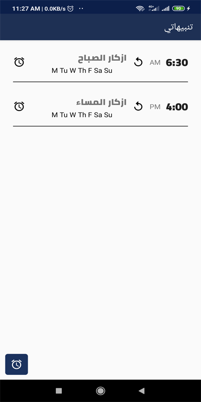

# Zekry

 
تطبيق زكري - Zekry
برنامج زكري هو برنامج يمكنك من قراءه الزكار اليوميه والادعيه كما وردت عن الحبيب المصطفي _صلوات ربي وسلامه عليه_ بالاضافه الي التنبيهات اليوميه للاذكار , كما يمكنك اضافه تنبيهاتك الخاصه.
يدعم اللغه العربيه و الانجليزيه
شاركونا مقترحاتكم للتحديثات القادمه
 

 
Zekry App
 
 
Is an application that allows you to read daily and supplications Azkar as it came from the Prophet Mohamed - prayers and peace of God be upon him - in addition to the daily alerts for remembrance, and you can also add your own alerts.
 

 
Support English and Arabic languages.
 
share us your opinion for the upcoming updates.
 

 

  
  
  
  
  
  
  

 
